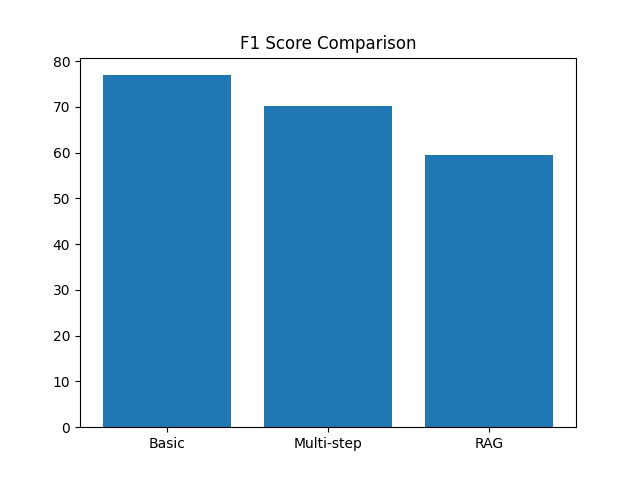
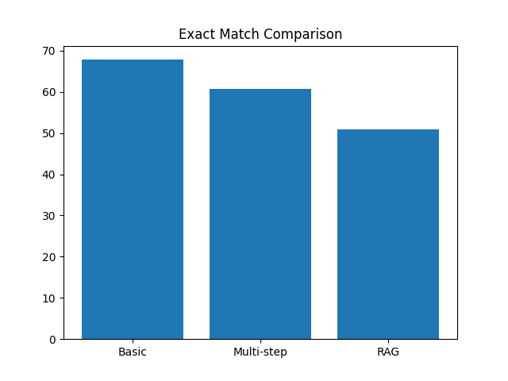

# Benchmark Report

## 1. Experiment Setup

* Model: DistilBERT (distilbert-base-cased-distilled-squad)
* Dataset: SQuAD
* Samples: 1000
* Task: Extractive Question Answering

### Agents:

1. Basic Agent (single-step)
2. Multi-step Agent (chunk-based)
3. RAG Agent (TF-IDF retrieval)

---

## 2. Metrics

* **Exact Match (EM)**: Measures exact string match
* **F1 Score**: Measures overlap between predicted and true answer

---

## 3. Results

| Model      | Architecture   | Exact Match | F1 Score |
| ---------- | -------------- | ----------- | -------- |
| Basic      | Single-step QA | 67.8        | 76.9     |
| Multi-step | Chunk-based QA | 60.8        | 70.18    |
| RAG        | Retrieval + QA | 50.9        | 59.36    |

---
## 4. Analysis

### 1. Strengths

#### Basic Agent (Single-step)

* High accuracy due to full context availability
* Simple and efficient architecture
* Fast inference with single model pass

#### Multi-step Agent

* Better handling of long contexts through chunking
* More structured reasoning approach
* Scalable to larger documents

#### RAG Agent

* Modular architecture (retrieval + QA)
* Scalable for large-scale datasets
* Efficient when full context cannot be processed

---

### 2. Weaknesses

#### Basic Agent

* Limited scalability for very large contexts
* Performance may degrade with extremely long inputs

#### Multi-step Agent

* Loss of global context due to chunking
* Increased computational cost (multiple passes)
* May select suboptimal chunks

#### RAG Agent

* Strong dependency on retrieval quality
* TF-IDF retrieval does not capture semantic meaning
* Incorrect chunk selection leads to poor performance

---

## 5. Insights

* The basic agent performs best due to full context availability.
* Multi-step agent suffers from context fragmentation.
* RAG performance is limited by TF-IDF retrieval quality.
* Retrieval accuracy directly impacts overall performance.

---

## 6. Trade-offs

| Factor      | Basic | Multi-step | RAG    |
| ----------- | ----- | ---------- | ------ |
| Accuracy    | High  | Medium     | Low    |
| Speed       | Fast  | Slow       | Medium |
| Scalability | Low   | Medium     | High   |

---
## 7. Visualization

### F1 Score Comparison

### Exact Match Comparison

### Insight from Visualization

The graphs show that the Basic (single-step) agent achieves the highest performance in both F1 score and Exact Match.

The Multi-step agent performs moderately, while the RAG-based agent shows lower performance due to limitations in the retrieval mechanism.

This highlights that while advanced architectures improve scalability, they may reduce accuracy if retrieval or context handling is not optimal.

## 8. Conclusion

* Single-step QA is best for structured datasets like SQuAD.
* RAG is more suitable for large-scale real-world applications.
* Retrieval quality is the key factor for improving RAG systems.
